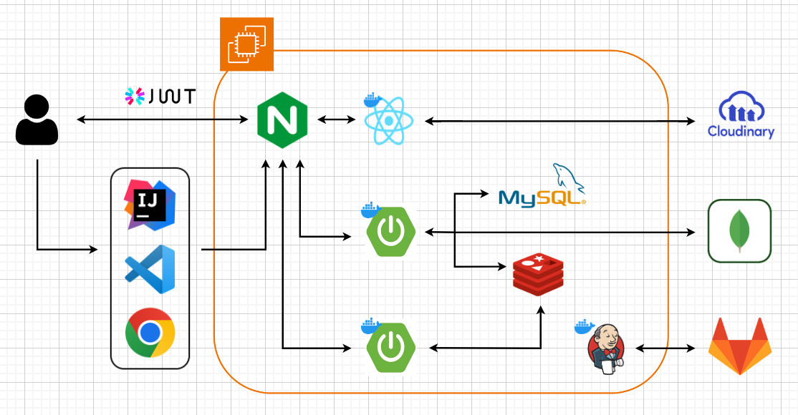
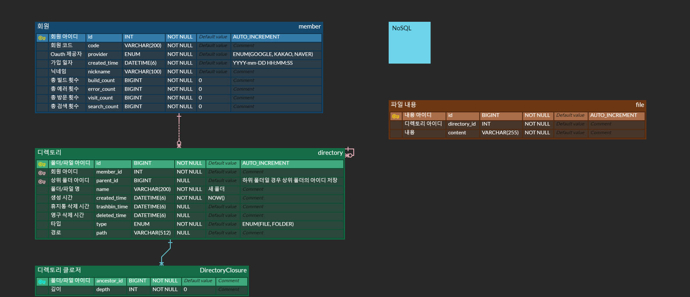

# Ododoc
### 개발과 정리를 한 번에
### IntelliJ, VS Code, Chrome에 확장프로그램을 설치하고 
### 검색 결과, 코드, 오류 정보를 정리해 드립니다.

<br>

##  Ododoc 소개 및 (UCC+시연) 영상
#### ✔ 소개
<br>

#### ✔ UCC 영상
<br>

#### ✔ 시연 영상

<br>

##  서비스 아키텍처

<br>

##  기술 스택
###  프론트 
- React
- TypeScript
- Cloudinary
<br>

###  백앤드
- Spring Boot
- Spring Security
- JWT
- Jasypt
- Gradle
- JPA
- QueryDSL
- MySQL
- Mongo DB
- Redis
- Junit5
- Swagger
- websocket
<br>

###  Infra
- AWS EC2
- nginx
- docker
- jenkins
<br>
<br>

##  포팅 메뉴얼


<br>

## 👨‍👩‍👧 협업툴
#### ✔ 버전 관리


<br>
<br>

#### ✔ 개발 일정 관리


<br>
<br>

#### ✔ 커뮤니케이션


<br>
<br>

##  컨벤션
####  Jira
- 월요일 오전 작성
- 백로그 말머리 작성 : [FE], [BE], [공통]
- 개발 관련 = 스토리, 비개발 관련 = 작업
- 스토리 포인트는 1시간에 1포인트 기준(최소 1이상, 10분 이하는 0점)
- 스토리 포인트는 4를 넘지 않도록 한다(업무는 최대 4시간 이하로 분할해야 한다.)
- 여러 명이 TASK에 참여할 경우 같은 TASK를 만들어 담당을 배분한다.
- SubTask는 사용하지 않음


####  Git

## Git 커밋 메시지 컨벤션

```jsx
// 커밋 예시
feat: 버튼 추가

// 본문
자유롭게 쓰자
마음대로 쓰자
```

| feat | 새로운 기능, 특징 추가 |
| --- | --- |
| fix | 수정, 버그 수정 |
| docs | 문서(README, Java Doc, Swagger 등)에 관련된 내용, 문서 수정 |
| style | 코드 포맷, 세미콜론 누락, 코드 변경이 없을 경우 (코드 스타일) |
| refactor | 원래도 정상적으로 동작하던 것을 수정, 추가, 보완(결과는 그대로 코드 개선) |
| chore | 빌드 업무 수정, 패키지 매니저 수정 |
| test | 테스트 코드 수정, 누락된 테스트를 추가할 때, 리팩토링 테스트 추가 |
| design | CSS 등 사용자 UI 디자인 변경 |
| hotfix | 너무 급해 |
| init | 프로젝트 초기 생성 |

##  Git Flow
- 프로젝트 명 : 오도독
- 프론트 : frontend
    - frontend/fe_repo
- 백 : backend
- 익스텐션: extension
    - vscode: extension/ododoc-vsc
    - intellij : extension/ododoc-intellij
    - chrome: extension/ododoc-chrome

### 최종 branch

<aside>
💡 master

</aside>

- 여기가 모든 소스 코드가 통합된 브랜치

### develop branch

<aside>
💡 develop

</aside>

### 파트 develop branch

<aside>
💡 FE
BE/main  ⇒ 미정
BE/  ⇒ 미정
EXT/vscode
EXT/intellij
EXT/chrome

</aside>

- 각 파트별 통합 브랜치

### branch 네이밍

<aside>
💡 필드(/파트)_타입/브랜치명
**FE_feature/fruit_create
BE/main_feature/fruit_create
EXT/vscode_feature/fruite_create**

</aside>

- **git ignore 파일 관리 필요**
    - local setting 파일들 추가 ex) work.ini

- 중앙집중식 워크플로우를 개선한 워크플로우로, feature 브랜치, hotfix 브랜치 등 다양한 브랜치를 사용합니다.
- feature 브랜치에서 개발을 진행하고, 각 파트의 develop 브랜치로 병합합니다.
- hotfix 브랜치에서 긴급한 수정을 진행하고, develop 브랜치로 병합합니다.
- refactor 브랜치에서 이미 개발한 기능에 대해서 리패토링을 진행하고 develop 브랜치로 병합합니다.

| 브랜치 | 용도 |
| --- | --- |
| master | 제품 출시/배포 |
| develop | 출시 전 병합 및 테스트 |
| feature | 기능개발 |
| fix | 기능 수정 사항 적용 |
| hotfix | 긴급한 버그 수정 |
| release | 이번 출시 버전을 준비 |
| refactor  | 기능 리팩토링 |
| test | 테스트 코드 관련 |


##  팀원 역할
###  황찬준 (팀장_백엔드)
```
- VS Code 확장 프로그램 개발
```

<br>

###  김주이 (팀원_백엔드)
```
- ERD 설계
- 무한 디렉토리 조회, 생성, 수정, 삭제, 이동 api 개발
- 휴지통 조회, 복원, 영구 삭제 api 개발
- 프로필 조회 api 개발
- 파일 저장, 조회, 추가 api 개발
- mongoDB 백업 스케줄러 개발
- MockMVC 테스트 코드 작성
- Spring Rest Docs + Swagger 개발
```
<br>

###  이준희 (팀원_백엔드)
```
- Intelli J 플러그인 개발
```
<br>

###    윤정영 (팀원_인프라)
```
- Nginx로 리버스 프록시 서버 구성
- Jenkins로 CI/CD 구현
- Docker로 애플리케이션을 컨테이너화
- Chrome Extention으로 크롬 브라우저에서 데이터 수집 구현
- Chrome Extension과 웹서버 연동 로그인 구현
- Chrome Extension WebSocket 구현
- Chrone Extension UI/UX

```

<br>

###  서현재 (팀원_프론트)
```
- 마이페이지 개발
- 에디터 기능 개발
- 메인페이지 개발
- 클라우디너리 연결
```

<br>

###  이주미 (팀원_프론트)
```
- 로그인 구현
- 사이드바 디렉토리 기능 및 화면 구현
- 홈페이지 구현
- 가이드 페이지 구현
```
<br>

<br>


##  산출물

###  기능명세서

### 🎨 ERD
