## IntelliJ Extension 사용법

- File > Setting을 누르거나 Ctrl+Alt+S를 눌러 Setting창을 띄웁니다
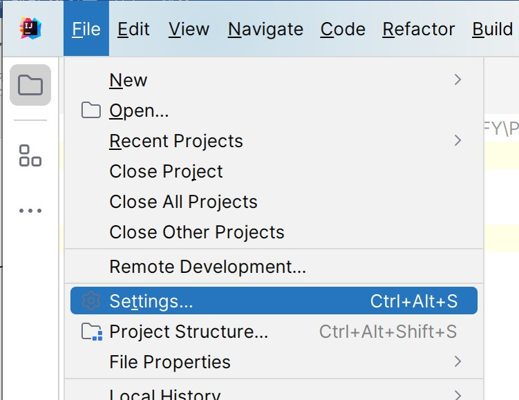

 

- 좌측 상단에 Plugins을 검색하고 Plugins 메뉴를 클릭합니다.
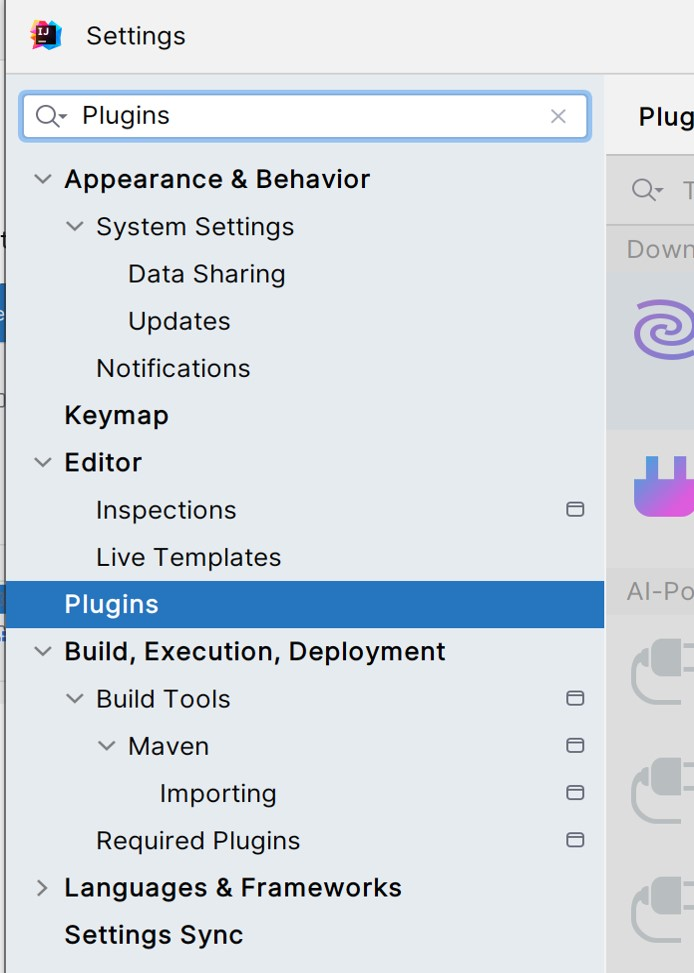

 

- 검색 창에 Ododoc을 검색하고 Install을 누릅니다.
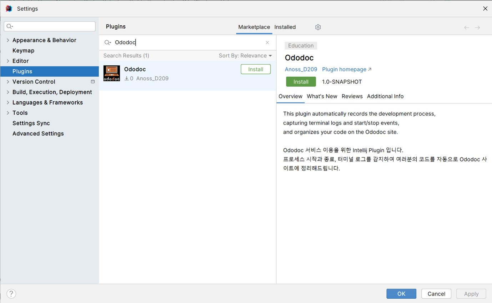

 

- Alt + C 나 Tools > Ododoc 메뉴를 누르면 Ododoc 플러그인을 사용할 수 있습니다.
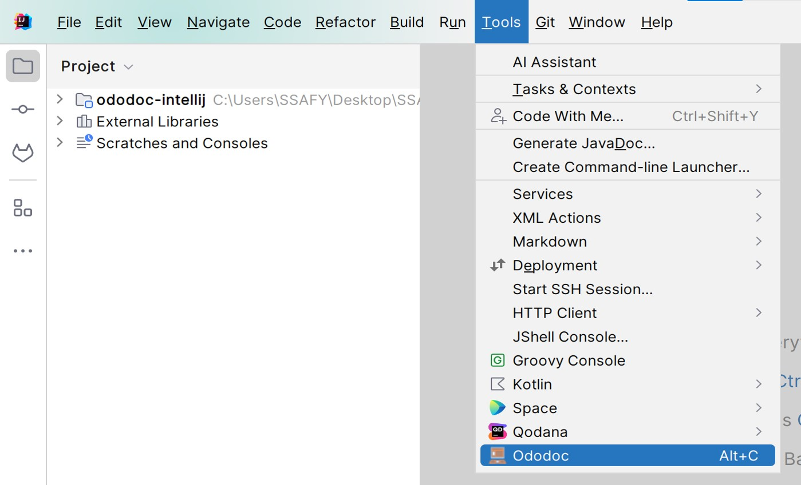

 

- 알맞은 소셜 계정으로 로그인을 합니다
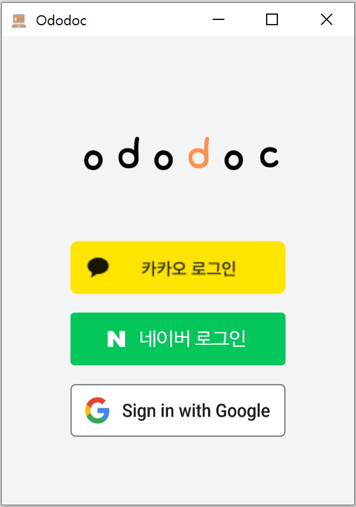

 

- 로그인이 완료되면 사용자의 디렉토리 정보를 조회할 수 있습니다.
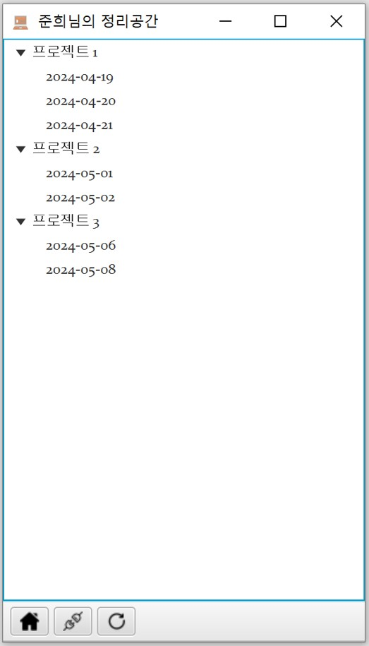

 

- 오른쪽 마우스 클릭 시 폴더 및 파일을 생성할 수 있습니다.
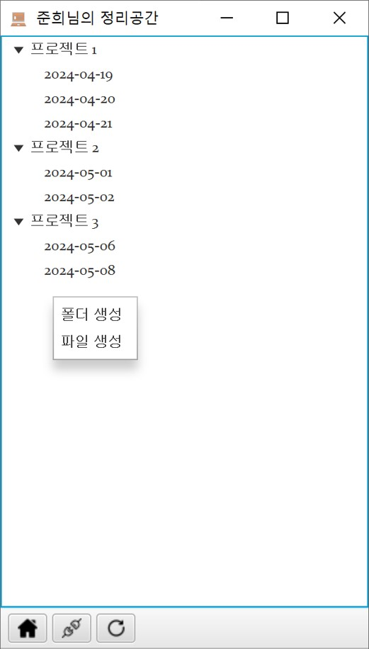

 

- 폴더 및 파일을 더블 클릭할 경우 이름을 수정할 수 있습니다.
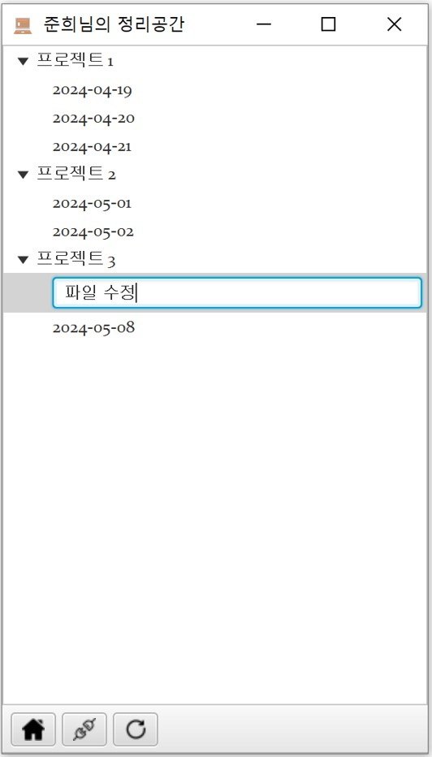

 

- 홈 버튼을 누를 시 Ododoc 페이지로 이동할 수 있습니다.
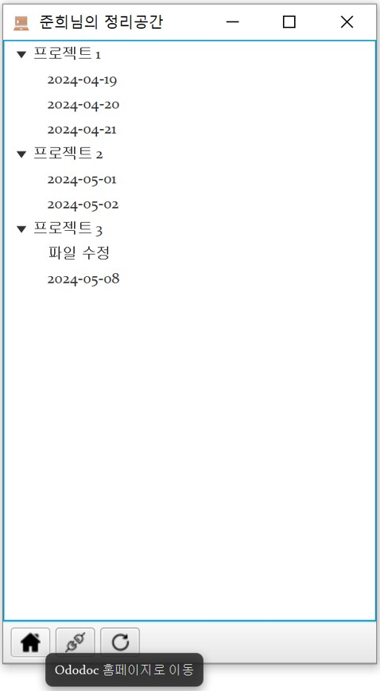

 

- 연결 버튼을 누를 시 서버와의 연결 상태를 확인하여 서버와 연결할 수 있습니다.
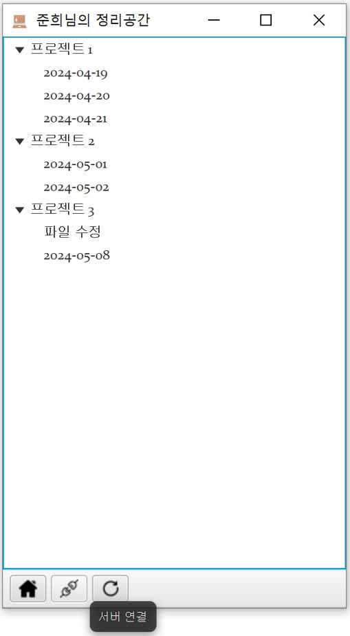

 

- 새로고침 버튼을 누를 시 디렉토리 정보를 다시 조회할 수 있습니다.
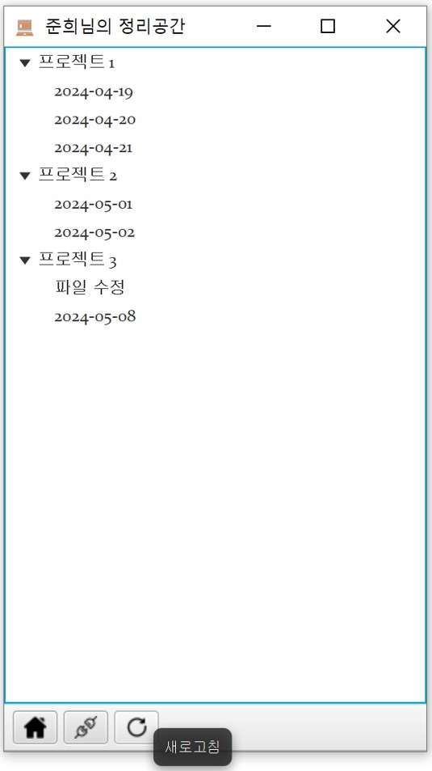

 

- 파일을 클릭하고 오른쪽 마우스 클릭 시 파일과 연동할 수 있습니다. 파일과 연동 시 해당 파일로 여러분의 개발 과정이 기록됩니다. 파일과 연동하지 않을 시 자동으로 파일이 생성되어 해당 파일로 개발 과정이 기록됩니다.
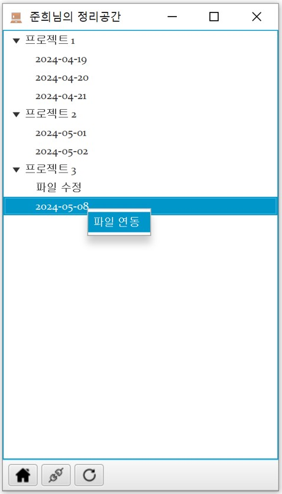

 

- 이제 코드를 Run 시킬 때 마다 여러분의 개발 과정이 기록됩니다!
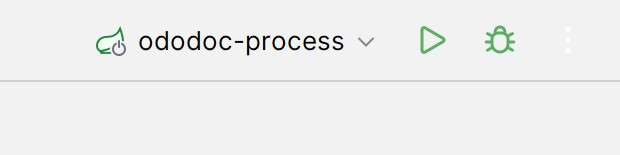